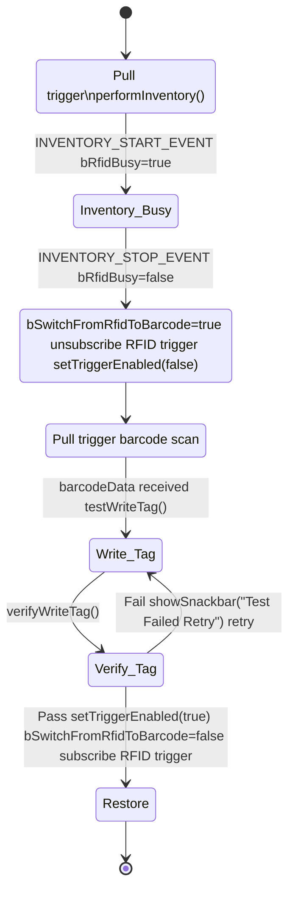

# Design Document: Zebra RFD40 Integrated Test Demo

## Overview
This document describes the technical design and state machine logic for the integrated test mode implemented in the Zebra RFD40 RFID reader demo app.

## State Machine & Flow
The app uses a state-driven approach to synchronize RFID and Barcode operations:

### State Variables
- `bRfidBusy`: True when RFID inventory is running; blocks config changes
- `bSwitchFromRfidToBarcode`: True during barcode phase; blocks RFID trigger events
- `Integrated Test Flag`: Set by UI to enable this test mode

### Step-by-Step Flow
1. **RFID Read (Inventory)**
   - User initiates test from UI
   - Pull trigger: Starts RFID inventory (`bRfidBusy = true`)
   - Release trigger: Stops inventory (`bRfidBusy = false`)
2. **Transition to Barcode Mode**
   - On inventory stop, set `bSwitchFromRfidToBarcode = true`
   - Disable RFID trigger events
   - Call `setTriggerEnabled(false)` to switch to Barcode mode
   - UI prompts user to scan barcode
3. **Barcode Scan & RFID Write/Verify**
   - Pull trigger: Barcode scan (no RFID event)
   - Barcode data received in UI
   - Call `testWriteTag(barcodeData)` to write barcode data to tag (synchronous)
   - Call `verifyWriteTag()` to confirm write
   - UI shows "TEST PASSED" if verification succeeds
4. **Restoration to RFID Mode**
   - On success, reset test flag
   - Call `setTriggerEnabled(true)` to restore RFID mode
   - Reset `bSwitchFromRfidToBarcode`
   - Enable RFID trigger events

## Reliability Features
- **Busy Protection**: All mode switches check `bRfidBusy` to avoid race conditions
- **Guard Flags**: `bSwitchFromRfidToBarcode` blocks unwanted trigger events
- **Synchronous Access**: Ensures write/verify are atomic and reliable
- **Test Pass**: Only if tag data matches barcode input after write/verify

## Main Classes
- `MainActivity`: UI, test mode control, and user interaction
- `RFIDHandler`: Manages RFID reader lifecycle, state machine, and trigger configuration
- `ScannerHandler`: Handles barcode scanner events and data

## State Machine Diagram (Mermaid)

See also: `docs/images/state_diagram.png` for a rendered image.

## References
- Source code: `app/src/main/java/com/zebra/rfid/demo/sdksample/`
- README.md for project overview
