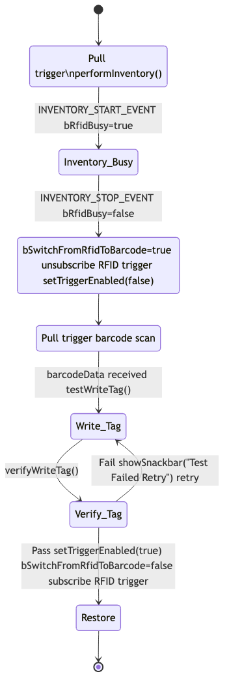

# Integrated Test Flow: RFID Read → Barcode Scan → Write & Verify → Restore

This document details the state machine and event-driven process for the integrated test mode on the Zebra RFD40, ensuring reliable execution and test pass criteria.

---

## Overview
This flow enables a seamless, automated test that:
- Reads RFID tags (inventory)
- Switches hardware trigger to barcode mode
- Scans a barcode and writes its data to an RFID tag
- Verifies the write
- Restores the trigger to RFID mode

---

## State Variables
- **bRfidBusy**: True when RFID inventory is running; blocks config changes
- **bSwitchFromRfidToBarcode**: True during barcode phase; blocks RFID trigger events
- **Integrated Test Flag**: Set by UI to enable this test mode

---

## Step-by-Step Flow

### 1. RFID Read (Inventory)
- User selects integrated test mode in the UI
- State: `bRfidBusy = false`, `bSwitchFromRfidToBarcode = false`, Test Flag = true
- User pulls trigger → `performInventory()`
- On `INVENTORY_START_EVENT`: `bRfidBusy = true`

### 2. Transition to Barcode Mode
- User releases trigger → `INVENTORY_STOP_EVENT`
- On event:
    - `bRfidBusy = false`
    - `bSwitchFromRfidToBarcode = true`
    - `subscribeRfidHardwareTriggerEvents(false)`
    - `setTriggerEnabled(false)` (switches to barcode mode)
    - UI prompts: "Pull Trigger: Scan Barcode for write tag data input"

### 3. Barcode Scan & RFID Write/Verify
- User pulls trigger → hardware performs barcode scan
- Barcode data received in UI
- `testWriteTag(barcodeData)` called:
    - Synchronously writes barcode data to tag (`writeWait`)
- `verifyWriteTag()` called:
    - Synchronously reads tag and checks for correct data
- If verification passes:
    - UI shows "TEST PASSED"

### 4. Restore to RFID Mode
- Reset test flag in UI
- `setTriggerEnabled(true)` (switches back to RFID mode)
- `bSwitchFromRfidToBarcode = false`
- `subscribeRfidHardwareTriggerEvents(true)`

---

## Reliability & Test Pass Criteria
- **Busy Protection**: All mode switches check `bRfidBusy` to avoid race conditions
- **Guard Flags**: `bSwitchFromRfidToBarcode` blocks unwanted trigger events
- **Synchronous Access**: Ensures write/verify are atomic and reliable
- **Test Pass**: Only if tag data matches barcode input after write/verify

---

## Diagram

Source: `docs/images/state_diagram.mmd`

Release alignment: `dev1` (see `RELEASE_NOTES_dev1.md`)

---

## References
- See `RFIDHandler.java` for implementation
- See `README.md` for usage

---

## Update Note (2026-02-21)
- Optimize timing for wait for reader idle by polling every `500ms` for up to `10` loops.
- This replaces fixed sleep behavior and improves responsiveness during trigger mode restoration.
